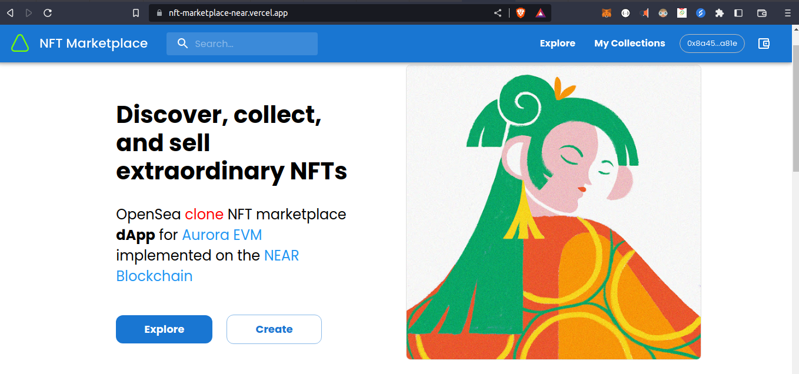

# OpenSea-clone-on-near
[OpenSea](https://opensea.io/) clone NFT marketplace for [Aurora EVM](https://aurora.dev/) implemented on the [NEAR Blockchain](https://near.org/)

 ## Click on the link below for live demo
  https://nft-marketplace-near.vercel.app/
### What is this
The NFT Marketplace as a decentralized Web3 application built over a javascript software stack using EVM-based backend software, tools, and specification but for a non-EVM protocol platform i.e. NEAR using Aurora EVM and its currency.

This enables users to list their NFTs on the NEAR platform and get benefits of lower gas charges and the benefit of a non-EVM blockchain protocol and platform. Here NFTs trading like directly sells, auction, lists, unlisting, etc. are feasible. </br>
 ***NB: Currently its configured to connect Aurora TestNet.*** so connect this website with your Aurora TestNet network in your MetaMask Wallet and ensure you have sufficent balance.

### How this is build
1. Frontend application has built on the react.js (javascript) and @mui material design UI library
2. Smart contracts have been built on solidity and compiled with the Hardhat EVM development tool
3. VS Code, Hardhat and Truffle, and MetaMask, Ethers have been used in the application development
4. Ethers and @web3-react javascript library used for communication with the MetaMask wallet and the smart contracts deployed at Aurora implemented over the NEAR platform.
5. Pinata for storing and pinning media and metadata in the IPFS decentralized file system.
6. Metamask for Aurora wallet and cryptocurrency

### Installation
1. Download the repository into your computer and go inside its root directory
2. Install libraries in the root directory by command
   ```
   npm install
   ```
3. craete a ```.env``` file on the root directory and add followings
    ```
    NODE_ENV=production
    AURORA_PRIVATE_KEY=<Your Aurora TestNet Account's Private Key>
    REACT_APP_API_KEY=<Pinata API_KEY>
    REACT_APP_API_SECRET=<Pinata API_SECRET>
    REACT_APP_JWT=<Pinata JWT>
    ``` 

    [Pinata NFT media management](https://www.pinata.cloud/)

### Smart Contract Addresses [Aurora Testnet]
Change the address (in the ```src/config/contractAddress.js```) if you deploy the factoryContract and marketPlace freshly using the Hardhat CLI

Address of currently deployed smart contacts are
```
exports.factoryContractAddress = "0xf5351DFC815b83289d1b4aDeC5c6A423eb523729";
exports.nftMarketplaceAddress = "0x2b82bedAaB3C8dCD16b71a5cc7AB119Afa6D7D2C"; 
```

It is recommend you to 
1. FIrst used the addresses (as above) of already deployed smart contracts on the Aurora Testnet for frontend application developemnt and integration with smart contracts perspective. 
2. Thereafter do the changes and deploy smart contracts then integrate with your frontend application


### Hardhat
Hardhat is a very popular EVM (Ethereum Virtual Machine) development environment. 
It is **Strongly Recommended** to check about the Hardhat at https://hardhat.org/getting-started/ before proceeding further below

### Compile contracts

```npx hardhat compile```

### Run test

Aurora Testnet:
```npx hardhat test --network testnet_aurora``` 

localhost:
```npx hardhat test --network localhost```  

this will compile the contract if not done earlier

### Smart Contract deployment
Use Hardhat CLI to deploy contracts

**Aurora TestNet:**
 
  ```
  npx hardhat run scripts/deploy.js --network testnet_aurora
  ```

  Hardhat takes testnet_aurora parameters from the ```hardhat.config.js``` in the root directory

**Local Hardhat EVM environment:**

1. Run Hardhat EVM development environment in your computer
    ```
    npx hardhat node
    ```

2. Deploy contracts with running the local EVM
   ```
   npx hardhat run scripts/deploy.js --network localhost
   ```
    No need to do any configuration in the file ```hardhat.config.js``` for the deployement to localhost since it is automatically identified by the Hardhat CLI


